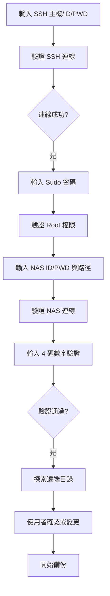
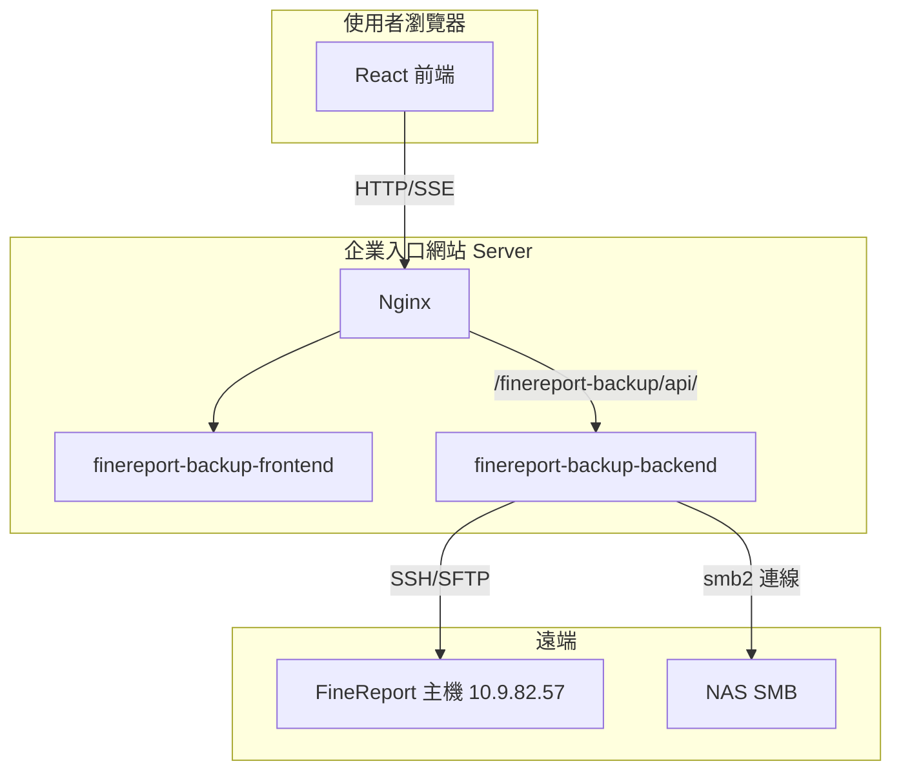

# FineReport 備份工具 — 開發計畫


**專案**：FineReport 備份工具  
**版本**：v1.0.0  
**最後更新**：2026-03-02  
**徽章使用規範**：本文件遵循 [徽章使用規範](../../3.ISO27001稽核自動化需求/0.standards/徽章使用規範.md)

---

## 1. 目的

本計畫將 FineReport 備份工具的需求、架構與實作規格整理為可執行的開發文件，供後續實作參考。專案以 Web 方式開發，部署於企業入口網站 Server。

---

## 2. 範圍

| 項目 | 說明 |
|------|------|
| 專案目錄 | 4.FineReport備份工具/ |
| 部署目標 | 企業入口網站 Server（與 deploy/docker-compose.yml 整合） |
| 子路徑 | `/finereport-backup/` |
| 技術棧 | 前端 React + Vite + TypeScript；後端 Node.js + Express + TypeScript |

---

## 3. 功能需求

### 3.1 憑證輸入流程



- **SSH**：主機、使用者（如 crownap）、密碼
- **Root**：SSH 連線成功後，使用者再輸入 sudo 密碼以取得 root 權限
- **NAS**：輸入 ID/PWD 後才連線，不常駐掛載
- **4 碼數字驗證**：SSH、sudo、NAS 驗證完成後，輸入系統顯示的 4 碼數字，防止機器人登入；通過後才能探索遠端目錄與後續作業

### 3.2 目錄確認與變更

- 顯示遠端來源目錄，讓使用者確認或變更
- 顯示 NAS 備份目錄，讓使用者確認或變更

### 3.3 備份來源

- **預設 9 項**：config、jar、plugins、reportlets、schedule、embed、tomcat/conf、finedb、mysql
- **自訂**：可手動新增來源目錄與目的路徑

### 3.4 刪除舊備份

- 可選功能，**預設不執行**
- 保留期選項：不執行、3 個月、6 個月、1 年、2 年

### 3.5 備份執行與報告

- 使用者確認後開始備份
- 畫面上顯示備份進度
- 完成後在備份目錄產生完成報告

---

## 4. 預設備份目錄對應

| 項目 | 來源 | 目的（相對於 /home/crownap/backup/備份月份/） |
|------|------|-----------------------------------------------|
| 平台設定 | config/auto/{latest} | webroot/config |
| Java 套件 | jar/auto/{latest} | webroot/jar |
| Plugin 套件 | plugins/auto/{latest} | webroot/plugins |
| 報表範本 | reportlets/auto/{latest} | webroot/reportlets |
| 自動定時執行 | /opt/tomcat/webapps/webroot/WEB-INF/schedule | WEB-INF/schedule |
| embed | /opt/tomcat/webapps/webroot/WEB-INF/embed | WEB-INF/embed |
| Tomcat 設定 | /opt/tomcat/conf | tomcat/conf |
| MySQL finedb | /opt/mysql/mysqldata/finedb | mysqldata |
| MySQL mysql | /opt/mysql/mysqldata/mysql | mysqldata |

`{latest}` 由探索 `xxx/auto/` 下最新時間戳目錄（如 `2025.01.03_02.00.00_xxxxx`）解析。

---

## 5. 架構設計

### 5.1 系統架構



### 5.2 目錄結構

```
4.FineReport備份工具/
├── frontend/
│   ├── src/
│   │   ├── components/
│   │   │   ├── CredentialForm.tsx      # SSH + Sudo + NAS 憑證
│   │   │   ├── HumanVerification.tsx   # 4 碼數字驗證（防機器人）
│   │   │   ├── RemotePathSelector.tsx  # 遠端來源（含自訂）
│   │   │   ├── NasPathSelector.tsx     # NAS 路徑
│   │   │   ├── RetentionOption.tsx     # 刪除舊備份選項
│   │   │   ├── BackupProgress.tsx      # 進度顯示
│   │   │   └── BackupReport.tsx        # 完成報告
│   │   ├── api/
│   │   └── App.tsx
│   ├── package.json
│   ├── vite.config.ts                  # base: '/finereport-backup/'
│   └── nginx/default.conf
├── backend/
│   ├── src/
│   │   ├── index.ts
│   │   ├── routes/backup.ts
│   │   ├── services/
│   │   │   ├── sshService.ts
│   │   │   ├── nasService.ts
│   │   │   ├── backupExecutor.ts
│   │   │   └── pathDiscovery.ts
│   │   ├── constants/defaultBackupSources.ts
│   │   └── schemas/
│   ├── package.json
│   └── tsconfig.json
├── 1.docs/
│   └── FineReport備份工具-開發計畫.md   # 本文件
├── Dockerfile.frontend
├── Dockerfile.backend
└── README.md
```

---

## 6. 技術選型

| 層級 | 技術 | 說明 |
|------|------|------|
| 前端 | React 19 + Vite + TypeScript | 與教育訓練、AETIM 一致 |
| 後端 | Node.js 18 + Express + TypeScript | 參考 8.3.ai-agent-aetim/server |
| SSH/SFTP | ssh2、ssh2-sftp-client | 遠端連線與檔案傳輸 |
| NAS | smb2 | SMB 連線，依 ID/PWD 連線，不常駐掛載 |
| 進度 | Server-Sent Events (SSE) | 即時備份進度 |

---

## 7. API 規格

| Path | Method | 說明 |
|------|--------|------|
| /api/backup/verify-ssh | POST | 驗證 SSH 連線 |
| /api/backup/verify-sudo | POST | 驗證 sudo 密碼取得 root |
| /api/backup/verify-nas | POST | 驗證 NAS 連線 |
| /api/backup/verify-human | POST | 取得 4 碼驗證碼 / 驗證 4 碼數字（防止機器人） |
| /api/backup/discover-remote | POST | 探索遠端目錄，解析 {latest} |
| /api/backup/sources | GET | 取得預設 + 自訂來源 |
| /api/backup/sources | POST | 新增自訂來源 |
| /api/backup/start | POST | 開始備份，回傳 backupId |
| /api/backup/progress/:backupId | GET | SSE 進度串流 |
| /api/backup/report/:backupId | GET | 取得完成報告 |

---

## 8. 備份流程

1. 建立 SSH 連線（crownap）
2. 驗證 sudo 密碼，取得 root
3. （可選）若啟用刪除：依保留期刪除遠端 `/home/crownap/backup/` 下舊目錄
4. 建立備份月份目錄及 mysqldata、tomcat、WEB-INF、webroot
5. 對各來源執行 `cp -R`、`chown -R crownap.crownap`
6. 以 smb2 連線 NAS（依使用者輸入 ID/PWD）
7. SFTP 下載遠端備份至 NAS
8. 產生完成報告（Markdown）於備份目錄；若提供 PDF 下載，需於 Dockerfile 安裝中文字型

---

## 9. 部署整合

需修改的既有檔案：

- deploy/docker-compose.yml：新增 finereport-backup-frontend、finereport-backup-backend
- deploy/nginx/nginx.conf：新增 /finereport-backup/、/finereport-backup/api/ 轉發
- deploy/eip-portal/index.html：新增 FineReport 備份工具連結

---

## 10. 建議的開發順序（SDD）

本專案依 **Specification-Driven Development** 流程進行，開發順序如下：

| 階段 | 說明 | 產物 |
|------|------|------|
| **1. 需求分析** | 確認上述釐清事項（部署位置、NAS 型號、刪除範圍等） | 需求確認紀錄 |
| **2. PRD** | 撰寫產品需求文件（功能、流程、驗收條件） | FineReport備份工具-PRD.md |
| **3. PLAN** | 拆解任務（前後端、SSH、SFTP、SSE、報告） | 本計畫 §11 實作任務拆解 |
| **4. 技術設計** | 完成本設計的細化（API 規格、錯誤碼、資料結構） | [FineReport備份工具-技術設計.md](./FineReport備份工具-技術設計.md) |
| **5. 程式碼實作** | 依任務順序開發 | 前後端程式碼、Dockerfile、部署設定 |

**注意**：不得跳過前置階段，除非經明確許可並於文件中標註。

**進度追蹤**：請使用 [FineReport備份工具-SDD開發進度清單](./FineReport備份工具-SDD開發進度清單.md) 記錄各階段完成狀態。

---

## 11. 實作任務拆解

| 序 | 任務 | 產物 |
|----|------|------|
| 1 | 建立專案目錄與文件 | 4.FineReport備份工具/、1.docs/、本計畫 |
| 2 | 後端骨架 | package.json、index.ts、routes、services 骨架 |
| 3 | SSH/Sudo 服務 | sshService.ts、verify-ssh、verify-sudo |
| 4 | NAS 服務 | nasService.ts、verify-nas、smb2 連線 |
| 5 | 備份執行器 | pathDiscovery、backupExecutor、預設來源常數 |
| 6 | API 路由與 SSE | backup 路由、progress SSE、report |
| 7 | 前端骨架 | React + Vite、base、API client |
| 8 | 前端元件 | CredentialForm、HumanVerification、PathSelector、RetentionOption、Progress、Report |
| 9 | Dockerfile 與部署 | Dockerfile.frontend、Dockerfile.backend、docker-compose、nginx、eip-portal |
| 10 | 文件同步 | 0.docs/README.md、企業入口網站-Docker部署計畫.md |

---

## 12. 參考文件

| 文件 | 路徑 |
|------|------|
| SDD 開發進度清單 | 1.docs/FineReport備份工具-SDD開發進度清單.md |
| 技術設計 | 1.docs/FineReport備份工具-技術設計.md |
| 企業入口網站 Docker 部署計畫 | 0.docs/企業入口網站-Docker部署計畫.md |
| 企業入口網站實作產物清單 | 0.docs/企業入口網站-實作產物清單.md |
| AETIM 後端結構 | 8.自動蒐集威脅情報AETIM/8.3.ai-agent-aetim/server/ |
